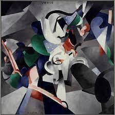
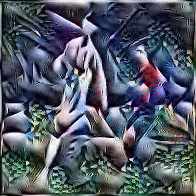

# NEURAL_STYLE_TRANSFER

* Neural Style Transferis a technique to apply stylistic features of a Style image onto a Content image while retaining the Content’s overall structure and complex features.
* Optimised the custom defined loss function using gradient tape.
* ContentImage1   StyleImage1  HybridImage1
 |  | 
* ContentImage2   StyleImage2  HybridImage2
 |  | 
